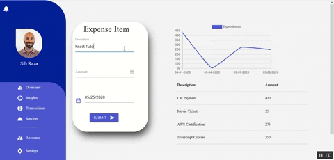

<h2>The Budget App</h2>

This is a full stack MERN app that allows users to track their expenses. Additionally, users can view their expense transactions in a table and line graph.

<h4>Used technologies</h4>
<ul>
  <li>Mongo DB</li>
  <li>Express.js</li>
  <li>React</li>
  <li>Node.js</li>
  <li>Materialize CSS</li>
  <li> Charts.js 2 </li>
</ul>

## Features

<h3>Dashboard</h3>

Users are placed on a main dashboard page. On this page, users can enter their expense item.

<h4> Future enhancements: </h4>
<ul>
<li>Account creation and management</li>
<li>Add the ability to manage balances, income, and expenses</li>
<li>Provide insights on budget management and spending</li>
<li>Create more modularity (e.g. move table to its own component)</li>
</ul>
